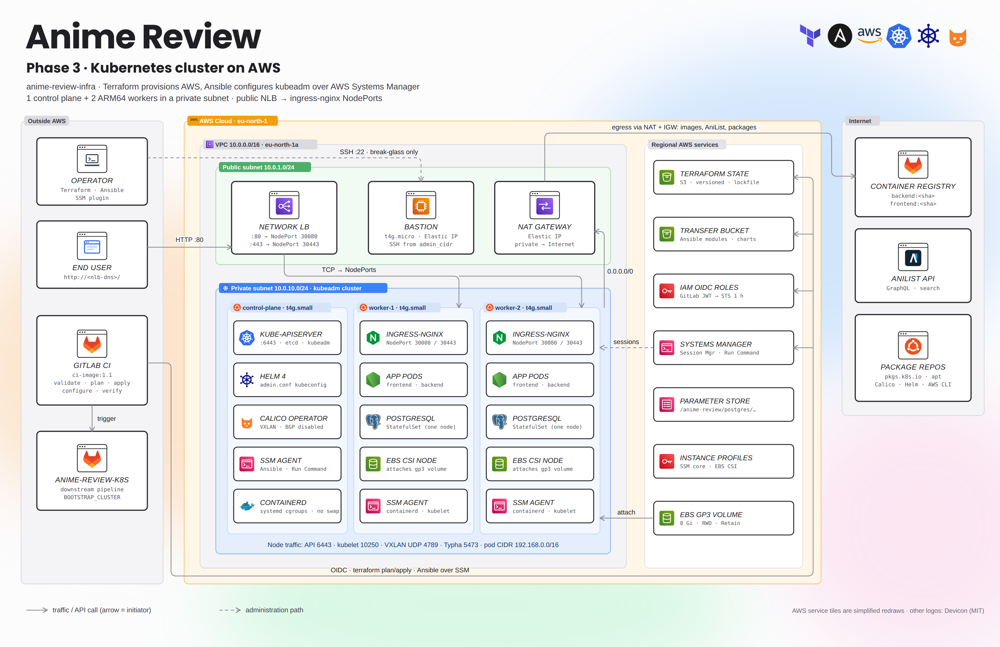
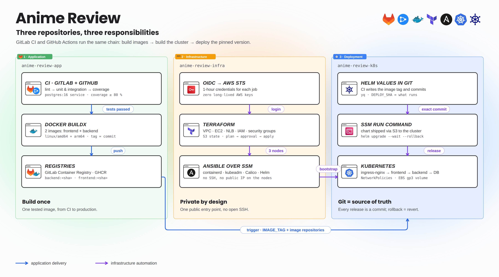
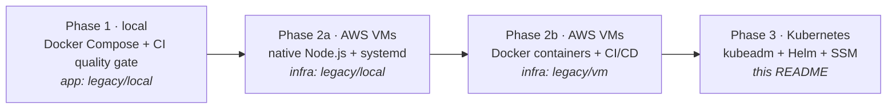
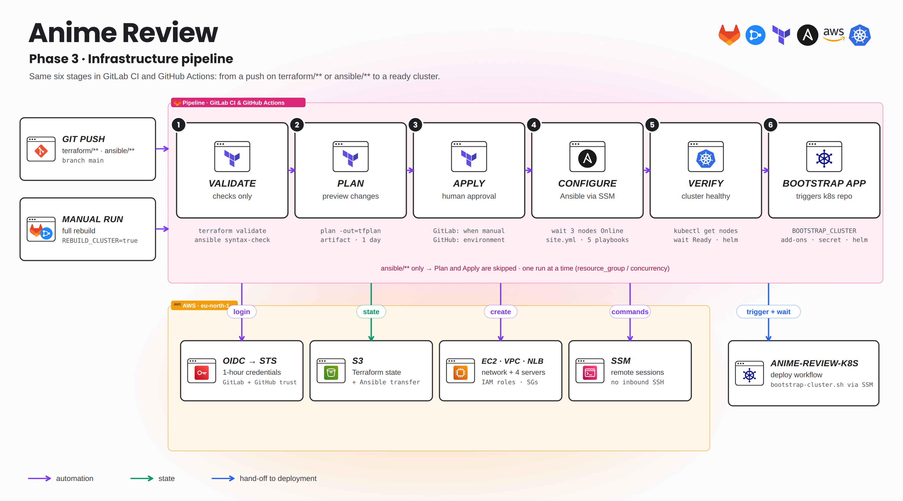
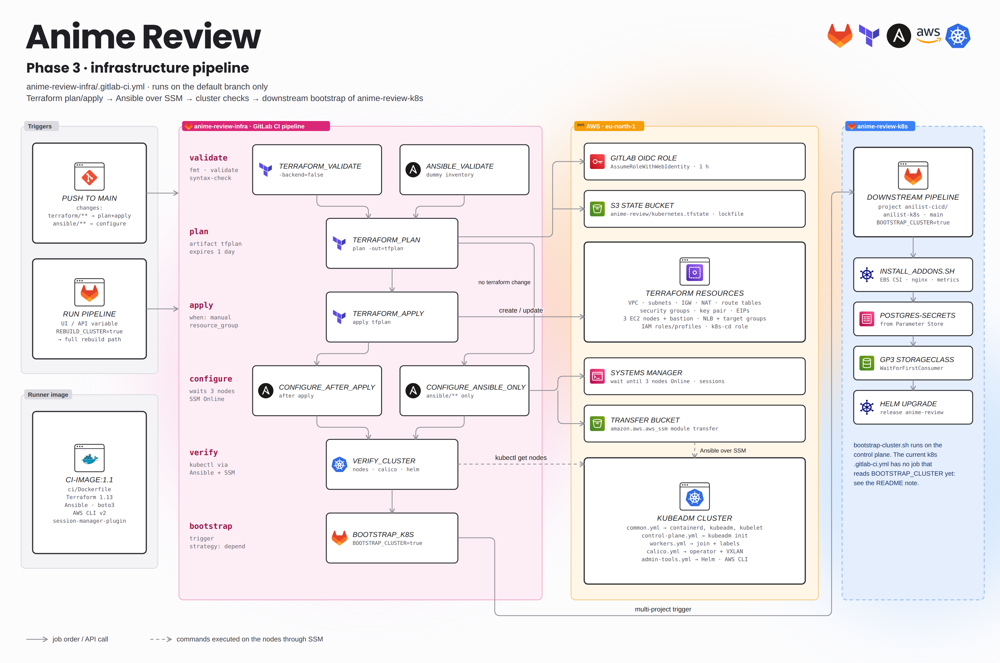
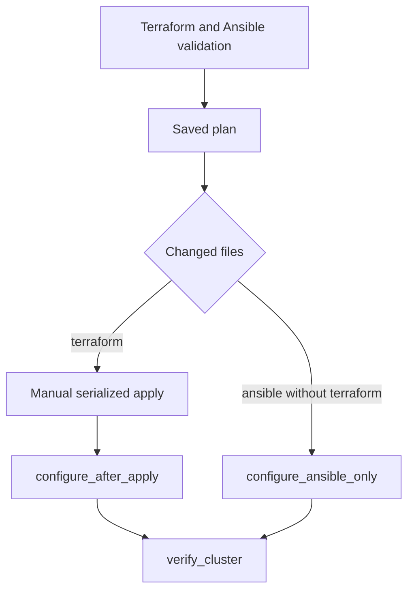

# Anime Review · Infrastructure (Kubernetes on AWS)

Terraform provisions the AWS network and machines; Ansible turns them into a **kubeadm Kubernetes cluster** (1 control plane + 2 ARM64 workers) that is administered **only through AWS Systems Manager**. This README covers **phase 3**, the current state of the project. Earlier phases are kept under [`legacy/`](#project-phases).


<details>
<summary><b>Detailed view</b> (every component, port and job)</summary>



</details>

| Repository | Role |
|---|---|
| [anime-review-app](https://github.com/Songhai9/anime-review-app) | Application code, tests, container images, app CI |
| **anime-review-infra** (this repo) | AWS foundations, VPC, EC2, NLB, IAM, kubeadm cluster |
| [anime-review-k8s](https://github.com/Songhai9/anime-review-k8s) | Cluster add-ons, Helm chart, continuous delivery |



## Project phases



| Phase | Where it is documented | Diagram |
|---|---|---|
| 1 · Local stack | [app › legacy/local](https://github.com/Songhai9/anime-review-app/tree/main/legacy/local) | Compose network |
| 2a · VMs, native Node.js | [legacy/local](legacy/local/README.md) | [02-vm-native](docs/assets/02-vm-native.png) |
| 2b · VMs, Docker | [legacy/vm](legacy/vm/README.md) | [02-vm-docker](docs/assets/02-vm-docker.png) |
| 3 · Kubernetes | this README + [anime-review-k8s](https://github.com/Songhai9/anime-review-k8s) | [03-kubernetes](docs/assets/03-kubernetes.png) |

## Implemented DevOps features

**Infrastructure as Code (Terraform)**
- Separate states in one S3 bucket: `bootstrap.tfstate`, `terraform.tfstate` (VMs), `kubernetes.tfstate` (cluster). Versioning, SSE-S3 encryption, public access blocked, `prevent_destroy`, native S3 locking (`use_lockfile`, no DynamoDB).
- `bootstrap/` creates the long-lived foundations: state bucket, SSM transfer bucket, the GitHub OIDC identity provider and the CI role (trusted by GitLab **and** GitHub).
- `terraform/` creates the cluster: VPC `10.0.0.0/16`, public subnet `10.0.1.0/24` (bastion, NAT, NLB), private subnet `10.0.10.0/24` (all Kubernetes nodes), IGW, NAT Gateway, route tables, 5 security groups, EC2 instances, Elastic IPs, NLB + target groups, IAM roles and instance profiles.

**Network security**
- Nodes have no public IP. Egress goes through the NAT Gateway; ingress only through the NLB (TCP 80/443 → NodePorts 30080/30443 on the workers).
- Security groups reference each other instead of CIDRs: API 6443, kubelet 10250, Calico VXLAN UDP 4789, Typha 5473, NLB → NodePorts. SSH to the bastion only from `admin_cidr`.
- IMDSv2 required with hop limit 2 so pods such as the EBS CSI driver can use the node identity.

**Configuration management (Ansible over SSM)**
- Inventory generated from Terraform outputs; hosts are addressed by **EC2 instance ID** with the `amazon.aws.aws_ssm` connection plugin. Module files transit through a dedicated S3 bucket. Neither the workstation nor CI needs SSH, a bastion hop or a private key to manage the nodes.
- Idempotent playbooks: swap off, kernel modules and sysctls, containerd with systemd cgroups, kubelet/kubeadm and AWS CLI v2 on every node, kubectl and `kubeadm init` on the control plane, worker join with a short-lived token (never logged), node labels, Calico operator in VXLAN mode, Helm on the control plane.

**Identity**
- GitLab CI and GitHub Actions → AWS with **OIDC** only (`AssumeRoleWithWebIdentity`, 1 h credentials). No long-lived AWS keys in either platform. Trust is limited to the `main` branch (and, on GitHub, to the `infrastructure` environment).
- Separate roles: `GitLabAnimeReviewTerraformRole` (infra pipeline, both platforms), `k8s-cd` (k8s pipeline: S3 `k8s-bootstrap/*`, `ssm:SendCommand`), control-plane role (SSM core, read chart archives, read `/anime-review/postgres/password`), worker role (SSM core, EBS CSI).

**CI/CD** — see [Infrastructure pipeline](#infrastructure-pipeline). Same chain on GitLab CI (`.gitlab-ci.yml`) and GitHub Actions (`.github/workflows/infra.yml`).
- GitLab: custom runner image (`ci/Dockerfile`): Terraform 1.13, Ansible, boto3, AWS CLI v2, Session Manager plugin. GitHub: official setup actions + the plugin installed in the job.
- Validate → saved plan → **human-approved** apply (GitLab `when: manual`, GitHub `environment: infrastructure`), serialized (`resource_group` / `concurrency`) → Ansible → cluster checks → downstream bootstrap of `anime-review-k8s`.
- Path-based rules: Terraform changes go through apply, Ansible-only changes skip it. `REBUILD_CLUSTER=true` forces the whole chain.

## Repository layout

| Path | Content |
|---|---|
| `bootstrap/` | Terraform foundations (state bucket, transfer bucket, CI role) |
| `terraform/` | Phase 3 AWS resources |
| `ansible/` | Phase 3 inventory generator, playbooks, templates, collections |
| `ci/Dockerfile` | Runner image `ci-image:1.1` |
| `.gitlab-ci.yml` | Phase 3 pipeline (GitLab CI) |
| `.github/workflows/infra.yml` | Phase 3 pipeline (GitHub Actions) |
| `legacy/local/` | Phase 2a playbooks (native Node.js on VMs) |
| `legacy/vm/` | Phase 2b Terraform + Ansible (Docker on VMs) |
| `legacy/.gitlab-ci.yml` | Phase 2b pipeline (archived, inactive) |
| `docs/` | Bootstrap, workstation, variables, examples, recovered pipelines, diagrams |

## Before you deploy

### Checklist

| # | What | How |
|---|---|---|
| 1 | AWS account + admin profile for the first run | [docs/WORKSTATION.md](docs/WORKSTATION.md) |
| 2 | Tools: Terraform ≥ 1.10 (CI uses 1.13), AWS CLI v2, Session Manager plugin, Python 3, Ansible, `jq` | [docs/WORKSTATION.md](docs/WORKSTATION.md) |
| 3 | OIDC identity providers: `https://gitlab.com` (create it once), `token.actions.githubusercontent.com` (created by `bootstrap/`) | [docs/BOOTSTRAP-AWS.md §2](docs/BOOTSTRAP-AWS.md) |
| 4 | Two globally unique S3 bucket names (state + transfer) | [docs/BOOTSTRAP-AWS.md §1](docs/BOOTSTRAP-AWS.md) |
| 5 | `terraform apply` of `bootstrap/` | [docs/BOOTSTRAP-AWS.md §3](docs/BOOTSTRAP-AWS.md) |
| 6 | SSH key pair for the bastion (public key → Terraform; not used to manage the nodes) | `ssh-keygen -t ed25519 -f ~/.ssh/anime-review` |
| 7 | SecureString `/anime-review/postgres/password` in `eu-north-1` | [docs/BOOTSTRAP-AWS.md §6](docs/BOOTSTRAP-AWS.md) |
| 8 | Runner image pushed to your registry | [docs/BOOTSTRAP-AWS.md §5](docs/BOOTSTRAP-AWS.md) |
| 9 | CI variables / secrets for the platform(s) you use | tables below + [docs/CONFIGURATION.md](docs/CONFIGURATION.md) |

### Files to create from the examples

| Example (in this repo) | Copy to | Commit? |
|---|---|---|
| `docs/examples/bootstrap.terraform.tfvars.example` | `bootstrap/terraform.tfvars` | No |
| `docs/examples/kubernetes.terraform.tfvars.example` | `terraform/terraform.tfvars` | No |
| `docs/examples/operator.env.example` | `~/.config/anime-review/operator.env` (outside Git) | No |
| `docs/examples/gitlab-ci-variables.env.example` | nothing: reference for GitLab **Settings → CI/CD → Variables** | — |
| `docs/examples/github-actions.env.example` | nothing: reference for GitHub **Settings → Secrets and variables → Actions** | — |

### Values hard-coded in the repository

If you deploy into another account or GitLab group, replace these before the first `init`:

```bash
rg -n -i '429502077256|songhai9|anilist-cicd|eu-north-1' bootstrap terraform ansible ci .gitlab-ci.yml .github
```

`terraform/backend.tf` and `bootstrap/providers.tf` (bucket), `.gitlab-ci.yml` (`ANSIBLE_SSM_BUCKET`, runner image, downstream project), `terraform/main.tf` (`k8s-cd` trust subject), `terraform/variables.tf` (`k8s_transfer_bucket_name`), `terraform-ci-policy.json`.

### GitLab CI/CD variables (infra project)

| Variable | Type | Value |
|---|---|---|
| `AWS_ROLE_ARN` | Variable, protected | `terraform -chdir=bootstrap output -raw terraform_ci_role_arn` |
| `TF_VAR_admin_cidr` | Variable, protected | Your public IP `/32` (bastion SSH) |
| `TF_VAR_ssh_public_key` | Variable, protected | Contents of `~/.ssh/anime-review.pub` |

`ANSIBLE_SSM_BUCKET`, `AWS_REGION` and `REBUILD_CLUSTER` are defined in `.gitlab-ci.yml`. In the **anime-review-k8s** project, allow this project under **Settings → CI/CD → Job token permissions** so `bootstrap_k8s` can trigger it.

### GitHub Actions settings (infra repository)

| Name | Kind | Value |
|---|---|---|
| `AWS_ROLE_ARN` | variable | `terraform -chdir=bootstrap output -raw terraform_ci_role_arn` |
| `AWS_REGION` | variable | `eu-north-1` |
| `ANSIBLE_SSM_BUCKET` | variable | transfer bucket created by `bootstrap/` |
| `TF_VAR_ADMIN_CIDR` | variable | your public IP `/32` |
| `TF_VAR_SSH_PUBLIC_KEY` | variable | contents of `~/.ssh/anime-review.pub` |
| `K8S_WORKFLOW_TOKEN` | **secret** | fine-grained PAT on anime-review-k8s, *Actions: read and write* |
| Environment `infrastructure` | Settings → Environments | add **required reviewers**: this is the approval gate before `apply` |

Checklist: [`docs/examples/github-actions.env.example`](docs/examples/github-actions.env.example).

## Deploy the cluster

### The four layers

| Layer | Where | What | Lifetime |
|---|---|---|---|
| 1 · AWS foundations | `bootstrap/` | state bucket, SSM transfer bucket, GitHub OIDC provider, CI role | persistent: created once, kept across rebuilds |
| 2 · Cluster infrastructure | `terraform/` | VPC, NAT, NLB, bastion, control plane, workers, IAM | rebuildable |
| 3 · Cluster configuration | `ansible/` over SSM | containerd, kubeadm, Calico, Helm | rebuildable |
| 4 · Kubernetes bootstrap | [anime-review-k8s](https://github.com/Songhai9/anime-review-k8s) | add-ons, namespace, PostgreSQL Secret, StorageClass, Helm release | rebuildable |

A normal rebuild keeps layer 1 and starts again from `terraform/`.

Nothing in layers 3 and 4 uses SSH. Terraform outputs EC2 **instance IDs**. Ansible reaches the nodes through Systems Manager (`amazon.aws.aws_ssm`). The Kubernetes bootstrap goes through S3 + SSM Run Command, like the CI.

```
Terraform ─► EC2 instance IDs ─► AWS Systems Manager ─┬─ Ansible aws_ssm   (configure the nodes)
                                                      └─ SSM Run Command   (bootstrap / deploy Kubernetes)
```

The bastion is still provisioned by `terraform/`, so `admin_cidr` and `ssh_public_key` remain **mandatory** variables. The cluster workflow does not use it.

### 0 · Workstation and session

Install the tools and the Python virtual environment once: [docs/WORKSTATION.md](docs/WORKSTATION.md). Then start every session from the repository root:

```bash
aws login --profile YOUR_PROFILE                 # or: aws sso login --profile YOUR_PROFILE
. ~/.config/anime-review/operator.env            # AWS_PROFILE, AWS_REGION, ANSIBLE_SSM_BUCKET, ...
source .venv/bin/activate
aws sts get-caller-identity                      # check the account ID
```

`ANSIBLE_SSM_BUCKET` is the **transfer** bucket (`ansible_ssm_bucket_name`), not the Terraform state bucket. `generate_inventory.sh` refuses to run without it.

### 1 · Check the foundations

```bash
terraform -chdir=bootstrap init
terraform -chdir=bootstrap plan        # expect no changes
terraform -chdir=bootstrap output      # state bucket, transfer bucket, CI role
aws ssm describe-parameters \
  --parameter-filters 'Key=Name,Option=Equals,Values=/anime-review/postgres/password'
```

The SSM parameter must exist before layer 4. If you start from an **empty account**, follow [docs/BOOTSTRAP-AWS.md §3A](docs/BOOTSTRAP-AWS.md) first: the backend of `bootstrap/` is the bucket it creates, so the first apply uses local state and then `init -migrate-state`.

### 2 · Provision AWS (Terraform)

```bash
cp docs/examples/kubernetes.terraform.tfvars.example terraform/terraform.tfvars   # set admin_cidr + ssh_public_key
terraform -chdir=terraform fmt -check -recursive
terraform -chdir=terraform init
terraform -chdir=terraform validate
terraform -chdir=terraform plan -out=cluster.tfplan
terraform -chdir=terraform show cluster.tfplan
terraform -chdir=terraform apply cluster.tfplan
terraform -chdir=terraform output
```

Expected result:

```
VPC 10.0.0.0/16
├── public subnet 10.0.1.0/24     bastion · NAT Gateway · NLB
└── private subnet 10.0.10.0/24   control plane · worker-1 · worker-2
```

`cluster.tfplan` is not covered by `.gitignore`: delete it after the apply and never commit it. The NLB answers nothing until layer 4 is installed.

### 3 · Wait for the three nodes in SSM

```bash
terraform -chdir=terraform output -raw control_plane_instance_id
terraform -chdir=terraform output -json worker_instance_ids

aws ssm describe-instance-information \
  --query 'InstanceInformationList[].{Id:InstanceId,Status:PingStatus}' --output table
```

The **three IDs from Terraform** must be `Online`. Compare the IDs: a count of "3 Online" can include other instances in the account. EC2 `running` is not enough. If a node is missing, check its instance profile, the SSM agent and outbound HTTPS through the NAT.

### 4 · Generate the SSM inventory and test it

```bash
bash ansible/scripts/generate_inventory.sh
ansible control-plane -i ansible/inventory/inventory.ini -m ping
ansible k8s_nodes     -i ansible/inventory/inventory.ini -m ping
ansible k8s_nodes     -i ansible/inventory/inventory.ini -m wait_for_connection -a 'timeout=300'
```

In the generated `ansible/inventory/inventory.ini` (git-ignored), `ansible_host` is the **EC2 instance ID** and `node_private_ip` is the address kubeadm uses. There is no bastion IP. Expected result: `SUCCESS … "ping": "pong"` for control-plane, worker-1 and worker-2.

### 5 · Configure Kubernetes (Ansible)

```bash
ansible-playbook -i ansible/inventory/inventory.ini ansible/playbooks/site.yml
```

`site.yml` runs, in order:

| Playbook | Hosts | What it does |
|---|---|---|
| `common.yml` | all nodes | swap off, `overlay`/`br_netfilter`, sysctls, containerd (systemd cgroups), kubelet + kubeadm (held), AWS CLI v2 |
| `control-plane.yml` | control plane | kubectl, `kubeadm init` on the private IP (pod CIDR `192.168.0.0/16`), `/etc/kubernetes/admin.conf` |
| `workers.yml` | workers | short-lived join command, `kubeadm join`, `node-role.kubernetes.io/worker` label |
| `calico.yml` | control plane | Tigera operator + Installation (VXLAN, BGP disabled) |
| `admin-tools.yml` | control plane | Helm (checksum verified) |

### 6 · Verify the cluster

```bash
ansible control_plane -i ansible/inventory/inventory.ini -b -m shell \
  -a 'command -v aws && command -v kubectl && command -v helm'
ansible control_plane -i ansible/inventory/inventory.ini -b -m shell \
  -a '/usr/bin/kubectl --kubeconfig /etc/kubernetes/admin.conf get nodes -o wide'
ansible control_plane -i ansible/inventory/inventory.ini -b -m shell \
  -a '/usr/bin/kubectl --kubeconfig /etc/kubernetes/admin.conf get pods -n calico-system'
ansible control_plane -i ansible/inventory/inventory.ini -b -m shell \
  -a '/usr/local/bin/helm version'
```

Expected: `/usr/local/bin/aws`, `/usr/bin/kubectl` and `/usr/local/bin/helm`, three `Ready` nodes, and Calico running. There are no application pods yet, which is normal at this stage.

### 7 · Bootstrap Kubernetes and the application

Continue in [anime-review-k8s › First installation](https://github.com/Songhai9/anime-review-k8s#first-installation-bootstrap). There are two equivalent paths, and neither uses SSH:

- **GitHub Actions:** run *Kubernetes CD* with `bootstrap_cluster` checked.
- **From your workstation:** S3 + SSM Run Command, exactly what the CI does: `bash docs/examples/bootstrap-via-ssm.sh.example` in the k8s repo.

Then open `http://$(terraform -chdir=terraform output -raw nlb_dns_name)/`.

### Condensed runbook (foundations already in place)

```bash
# session
aws login --profile YOUR_PROFILE
. ~/.config/anime-review/operator.env && source .venv/bin/activate

# layer 2 · Terraform
terraform -chdir=terraform init
terraform -chdir=terraform plan -out=cluster.tfplan
terraform -chdir=terraform apply cluster.tfplan

# layer 3 · Ansible over SSM
bash ansible/scripts/generate_inventory.sh
ansible k8s_nodes -i ansible/inventory/inventory.ini -m ping
ansible-playbook -i ansible/inventory/inventory.ini ansible/playbooks/site.yml
ansible control_plane -i ansible/inventory/inventory.ini -b -m shell \
  -a '/usr/bin/kubectl --kubeconfig /etc/kubernetes/admin.conf get nodes -o wide'

# layer 4 · from anime-review-k8s
bash docs/examples/bootstrap-via-ssm.sh.example   # or: Kubernetes CD with bootstrap_cluster=true
```

## Infrastructure pipeline



<details>
<summary><b>Detailed view</b> (every component, port and job)</summary>



</details>



| Stage | GitLab CI job | GitHub Actions job | Runs when | Notes |
|---|---|---|---|---|
| detect | rules `changes:` | `changes` | always | GitHub diffs the push to decide which path runs |
| validate | `terraform_validate`, `ansible_validate` | `validate` | always | `fmt -check`, `validate`, Ansible `--syntax-check` on a dummy inventory |
| plan | `terraform_plan` | `plan` | GitLab: always · GitHub: `terraform/**` changed or rebuild | OIDC, `plan -out=tfplan`, artifact kept 1 day |
| apply | `terraform_apply` | `apply` | `terraform/**` changed or rebuild | applies the **saved** plan after approval: GitLab manual job, GitHub `environment: infrastructure` |
| configure | `configure_after_apply` / `configure_ansible_only` | `configure` | after apply, or `ansible/**` only | waits for 3 SSM nodes, generates the inventory, runs `site.yml` |
| verify | `verify_cluster` | (inside `configure`) | after configure | nodes, kube-system, calico-system, Helm, `wait Ready` |
| bootstrap | `bootstrap_k8s` | `bootstrap-k8s` | after verify | starts the k8s repo with `BOOTSTRAP_CLUSTER=true` and waits for it |

**Rebuild from the pipeline:** GitLab *Run pipeline* with `REBUILD_CLUSTER=true`, then start `terraform_apply`; GitHub *Actions → Infrastructure CI/CD → Run workflow* with `rebuild_cluster` checked, then approve the `infrastructure` environment. Everything after the approval is automatic, up to the application being deployed. The rebuild flag never destroys anything: to start from an empty account, run `terraform -chdir=terraform destroy` first.

## Troubleshooting

| Symptom | Where to look |
|---|---|
| STS `AccessDenied` in CI | OIDC provider audience, role trust subject (project path + `main`), `AWS_ROLE_ARN` |
| `TargetNotConnected` / Ansible hangs | instance ID in inventory, SSM `Online`, instance profile, NAT route |
| Ansible S3 transfer error | `ANSIBLE_SSM_BUCKET`, region, `curl` present on the node |
| Node `NotReady` | containerd, kubelet logs, Calico pods, SG rules 4789/5473 |
| `kubectl` tries `localhost:8080` | pass `--kubeconfig /etc/kubernetes/admin.conf` under `become` |
| NLB times out | targets healthy? ingress-nginx installed with NodePorts 30080/30443? |
| Plan wants to recreate everything | wrong account, region, backend key or variables |

## Teardown

Back up PostgreSQL first (see the k8s repository). Then `terraform -chdir=terraform destroy`. The EBS volume of the database has `reclaimPolicy: Retain` and is **not** managed by Terraform: delete it from the EC2 console if you no longer need it. Keep `bootstrap/` unless you are closing the project: it holds the state of everything else.

## More documentation

- [AWS foundations: buckets, OIDC, runner image, SSM parameter](docs/BOOTSTRAP-AWS.md)
- [Operator workstation](docs/WORKSTATION.md)
- [Variables, secrets and identities](docs/CONFIGURATION.md)
- [Recovered phase 2 pipelines](docs/ci-history/README.md)
- [Diagrams](docs/assets/README.md) · [full delivery chain, app to cluster](docs/assets/05-delivery-chain-detailed.png)
