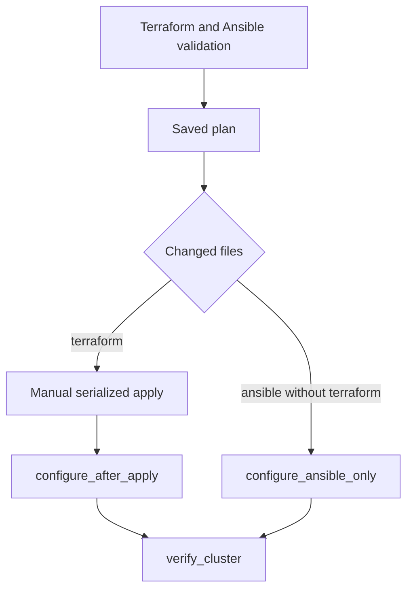

# Anime Review · Kubernetes infrastructure on AWS

Terraform provisions AWS resources. Ansible prepares and configures the machines. This repository preserves the historical VM deployments and now manages a kubeadm Kubernetes cluster administered through AWS Systems Manager.


## Deployment documentation

- [AWS foundations: S3 and OIDC](docs/BOOTSTRAP-AWS.md)
- [Prepare the operator workstation](docs/WORKSTATION.md)
- [Variables and credentials](docs/CONFIGURATION.md)
- [Provision and configure the cluster](#cluster-deployment)

Application code lives in [anime-review-app](https://github.com/Songhai9/anime-review-app). [anime-review-k8s](https://github.com/Songhai9/anime-review-k8s) installs Kubernetes add-ons, PostgreSQL and the application. Creating the cluster alone does not make the website available.

## Implemented features

**Foundations.** Terraform state in an S3 bucket with versioning, AES256 encryption, public-access blocking and Terraform deletion protection; S3 lockfiles; a separate temporary Ansible/SSM transfer bucket; a GitLab CI role using OIDC and temporary STS credentials.

**Networking.** Dedicated VPC, public subnet, private subnet(s), Internet Gateway, NAT Gateway, route tables and separate Security Groups. Bastion with an Elastic IP and SSH restricted to `admin_cidr`. The cluster code uses a single Availability Zone.

**Active cluster.** One control plane and two private `t4g.small` workers, 20 GiB root volumes, kernel/runtime preparation, containerd with systemd cgroups, kubeadm/kubelet/kubectl installation, temporary join token, Calico VXLAN and Helm. A public NLB forwards traffic to worker NodePorts. Worker IAM profiles provide EBS CSI permissions; every node has SSM permissions.

**Infrastructure CI/CD.** Dedicated tools image, Terraform/Ansible syntax checks, saved plan, manual apply, configuration after apply or after Ansible-only changes, then node verification. CI configures nodes through SSM without inbound SSH from the runner to those nodes.

## Repository layout

| Path | Purpose |
|---|---|
| `terraform/`, `ansible/` | Current phase: AWS kubeadm cluster |
| `bootstrap/` | S3 state, transfer bucket and CI identity foundations |
| [legacy/local](legacy/local/README.md) | Historical native Node.js/systemd deployment to AWS VMs |
| [legacy/vm](legacy/vm/README.md) | Historical Docker frontend/API deployment to AWS VMs |

The two legacy directories document variants of the VM phase. `legacy/local` means Ansible driven from the workstation, not local VMs. Local Docker Compose belongs to the application repository. All commands in these guides run from the repository root unless stated otherwise.


## Cluster deployment

### 1. Target outcome

The cluster has one control plane and two private ARM64 workers, a public bastion and an NLB. Terraform creates AWS resources, Ansible configures the runtime and Kubernetes, and the K8s repository subsequently installs add-ons and the application.

| Component | Configuration in the code |
|---|---|
| Region / AZ | eu-north-1 / eu-north-1a |
| VPC | 10.0.0.0/16 |
| Public subnet | 10.0.1.0/24, bastion, NLB, NAT |
| Private subnet | 10.0.10.0/24, all three nodes |
| Nodes | Ubuntu 24.04 ARM64, t4g.small, 20 GiB root volume |
| Bastion | t4g.micro, Elastic IP, SSH admin_cidr |
| Pods | CIDR 192.168.0.0/16; Calico VXLAN, BGP disabled |
| Kubernetes | v1.36 package repository; patch version not pinned |
| Calico / Helm | v3.32.2 / v4.3.0 |

These versions describe the inspected files. Before a fresh installation, check package/chart availability and compatibility. This README does not certify a new successful run with these versions.

### 2. Requirements and provisioning

Complete [BOOTSTRAP-AWS](docs/BOOTSTRAP-AWS.md). The Ansible controller needs AWS CLI, Session Manager plugin, Python/boto3/botocore, Ansible and the repository's collections, plus a profile allowed to start SSM sessions and use the transfer bucket.

```bash
cp docs/examples/kubernetes.terraform.tfvars.example terraform/terraform.tfvars
# Set the public key, admin CIDR and AWS values.
# Set terraform/backend.tf to your bucket and kubernetes.tfstate key.
terraform -chdir=terraform init
terraform -chdir=terraform fmt -check -recursive
terraform -chdir=terraform validate
terraform -chdir=terraform plan -out=cluster.tfplan
terraform -chdir=terraform show cluster.tfplan
terraform -chdir=terraform apply cluster.tfplan
terraform -chdir=terraform output
```

Do not put cluster resources in the VM state. Terraform creates the NLB, but its endpoint cannot yet serve the application: the Ingress controller, Services and application pods are not installed at this stage.

### 3. Wait for SSM before Ansible

The AMI must have a running SSM agent, outbound connectivity to AWS services and an appropriate instance profile. The repository attaches `AmazonSSMManagedInstanceCore` but does not explicitly install the agent through its playbooks.

```bash
aws ssm describe-instance-information \
  --query 'InstanceInformationList[].{Id:InstanceId,Status:PingStatus}' --output table
terraform -chdir=terraform output -raw control_plane_instance_id
terraform -chdir=terraform output -json worker_instance_ids
```

Verify that **the three IDs returned by Terraform** are `Online`, rather than any three instances in the account. For a missing instance, check IAM, agent status, DNS and outbound HTTPS through NAT. On Ubuntu, depending on installation, inspect `systemctl status amazon-ssm-agent` or `snap services amazon-ssm-agent`. EC2 `running` does not imply SSM `Online`.

### 4. Configure with Ansible

```bash
export ANSIBLE_SSM_BUCKET=YOUR_ANSIBLE_SSM_BUCKET
ansible-galaxy collection install -r ansible/requirements.yml
bash ansible/scripts/generate_inventory.sh
ansible-inventory -i ansible/inventory/inventory.ini --graph
ansible k8s_nodes -i ansible/inventory/inventory.ini \
  -m wait_for_connection -a 'timeout=300'
ansible k8s_nodes -i ansible/inventory/inventory.ini -m ping
ansible-playbook -i ansible/inventory/inventory.ini ansible/playbooks/site.yml
```

Inventory puts an **EC2 instance ID** in `ansible_host` for the SSM connection and the private IP in `node_private_ip` for kubeadm. It uses `amazon.aws.aws_ssm`. The S3 bucket transfers Ansible modules; it is neither a state bucket nor PostgreSQL volume storage. Target hosts need tools including `curl` for this mechanism.

Playbook order:

1. `common.yml`: disable active and boot-time swap, load `overlay`/`br_netfilter`, configure networking sysctls, install/configure containerd with systemd cgroups, and install Kubernetes components.
2. `control-plane.yml`: initialize kubeadm using the private IP and pod CIDR; prepare the administrative kubeconfig.
3. `workers.yml`: generate a temporary join command, join workers and apply labels. Tokens are not printed in logs.
4. `calico.yml`: install CRDs/operator and VXLAN configuration. Explicit kubeconfig avoids contacting an incorrect endpoint under `become`.
5. `admin-tools.yml`: download ARM64 Helm with checksum verification, then check its version.

File-based guards make tasks repeatable on an existing cluster, but do not automatically repair every partially broken cluster. Do not arbitrarily delete `admin.conf`/`kubelet.conf` to force reinitialization.

### 5. Verify the cluster

```bash
ansible control_plane -i ansible/inventory/inventory.ini -b -m command \
  -a '/usr/bin/kubectl --kubeconfig /etc/kubernetes/admin.conf get nodes -o wide'
ansible control_plane -i ansible/inventory/inventory.ini -b -m command \
  -a '/usr/bin/kubectl --kubeconfig /etc/kubernetes/admin.conf wait --for=condition=Ready nodes --all --timeout=120s'
ansible control_plane -i ansible/inventory/inventory.ini -b -m command \
  -a '/usr/bin/kubectl --kubeconfig /etc/kubernetes/admin.conf get pods -n calico-system'
ansible control_plane -i ansible/inventory/inventory.ini -b -m command \
  -a '/usr/local/bin/helm version'
```

All three nodes must be Ready; CoreDNS and Calico must work. It is normal for application pods not to exist yet. Continue with the K8s deployment guide: install EBS CSI, ingress-nginx, metrics-server, the SQL Secret, StatefulSet, Services, Deployments, Ingress and NetworkPolicies.

### 6. Networking, IAM and storage

Cluster traffic includes the Kubernetes API on 6443, kubelet on 10250, VXLAN on UDP 4789 and configured Calico traffic. NLB TCP 80/443 forwards to worker NodePorts 30080/30443. AWS Security Groups filter EC2 interfaces; Calico NetworkPolicies filter pods and belong to the K8s repository.

EBS CSI uses the worker role's `AmazonEBSCSIDriverPolicyV2` permissions. IMDSv2 access and hop limit 2 allow the relevant components to obtain node identity. This kubeadm cluster does not use EKS IRSA; permissions are shared at the EC2 identity level.

Node root disks of 20 GiB are separate from the 8 GiB PostgreSQL PVC. CSI creates the latter after the K8s repository's resources are installed. Retain preserves a volume according to its Kubernetes lifecycle; it provides neither backup nor automatic recovery after rebuilding a cluster.

### 7. Infra CI and trigger rules

Prepare `ci-image:1.1`, variables and OIDC as described in the bootstrap guide. `terraform_validate` skips the backend; `ansible_validate` checks syntax with a dummy inventory. The actual plan uses OIDC and becomes an artifact retained for one day.



`resource_group` serializes only apply, not all Ansible jobs or K8s deployments. Documentation-only changes do not configure the cluster. A pipeline started through the GitLab UI can evaluate `rules:changes` differently without a push comparison; inspect the generated jobs before triggering apply.

Manual apply uses the **saved plan**, not a freshly calculated plan. If the artifact expires, generate and review another plan. The code requests one-hour STS credentials for each job.

Current CI does not explicitly wait for SSM Online before configuration. Manual step 3 handles that prerequisite. A `REBUILD_CLUSTER` action and automatic application-bootstrap trigger were discussed but are not implemented in this commit.

### 8 - Deploy with Pipelines

Alternatively, you can automatically provision the infrastructure and deploy the app with a Kubernetes cluster. For that you need to manually trigger a pipeline with `REBUILD_CLUSTER=true`. This will start a pipeline that provisions AWS resources and, when finished, triggers [anime-review-k8s](https://github.com/Songhai9/anime-review-k8s) to deploy the cluster and make the application accessible.

### 9. Troubleshooting

| Symptom | Verifiable cause to investigate |
|---|---|
| STS `AccessDenied` | OIDC audience, subject, exact project/branch and AWS role |
| `TargetNotConnected` | EC2 ID, SSM Online, agent, IAM and NAT |
| Ansible S3 transfer failure | Transfer bucket, region, object permissions and target curl |
| NotReady nodes | containerd, cgroups, kubelet, Calico and pod routing |
| kubectl tries localhost:8080 | Explicitly pass `/etc/kubernetes/admin.conf` under root |
| CSI cannot create EBS | Worker role, IMDS, hop limit, CSI logs and AZ |
| Unreachable NLB | Registered workers, installed Ingress controller, NodePorts and SGs |
| Unexpected resource recreation in plan | Account, region, state key, variables and drift |

Rebuilding requires a data plan and a plan for retained EBS volumes. Preserving foundations, parameters and images alone does not restore the database.
