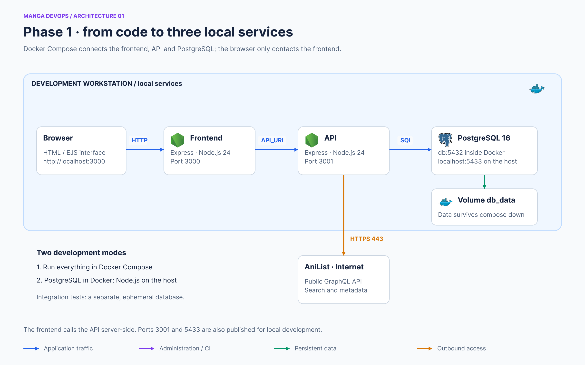

# Prepare the operator workstation

[Home](../README.md) · [AWS foundations](BOOTSTRAP-AWS.md)



Local application development does not require this infrastructure repository: follow `legacy/local/README.md` in `anime-review-app`. Docker Compose supplies the database and optionally both Node processes. Local execution requires no S3 bucket, GitLab token or AWS credentials.

For the cloud phases, install Git, Terraform 1.13 (the CI image version), AWS CLI v2, Python 3, Ansible, `jq`, an SSH client and the AWS Session Manager plugin. Install Docker if you plan to build the CI image. Terraform must be at least version 1.10 to support `use_lockfile`, even though the repository declares a looser version constraint.

```bash
git --version
terraform version
aws --version
ansible --version
jq --version
session-manager-plugin --version
```

An isolated Python environment installs Ansible tooling without changing the system Python:

```bash
python3 -m venv .venv
. .venv/bin/activate
python -m pip install ansible boto3 botocore
ansible-galaxy collection install -r ansible/requirements.yml
```

The repository does not fully pin these dependencies. Record the actual versions for reproducibility. AWS CLI and Session Manager installation is separate from the Python libraries.

Use an authorized AWS profile or an SSO profile. Explicitly select the profile and region before any operation:

```bash
export AWS_PROFILE=YOUR_PROFILE
export AWS_REGION=eu-north-1
export AWS_DEFAULT_REGION=eu-north-1
aws sts get-caller-identity
aws configure get region --profile "$AWS_PROFILE"
```

For SSO, first run `aws sso login --profile "$AWS_PROFILE"`. Check the returned account ID, especially when the workstation has several profiles. A profile configured for `eu-west-3` does not override `eu-north-1` values hardcoded in project files.

Create or select a demonstration SSH key for the bastion. The VM inventory generator expects `~/.ssh/anime-review`. Supply only its **public** key to Terraform; the private key stays on the workstation or in a GitLab File variable.

Before phase 2 or 3, populate the examples described in [CONFIGURATION](CONFIGURATION.md). Do not export a local profile in CI jobs: those jobs receive credentials through OIDC.
