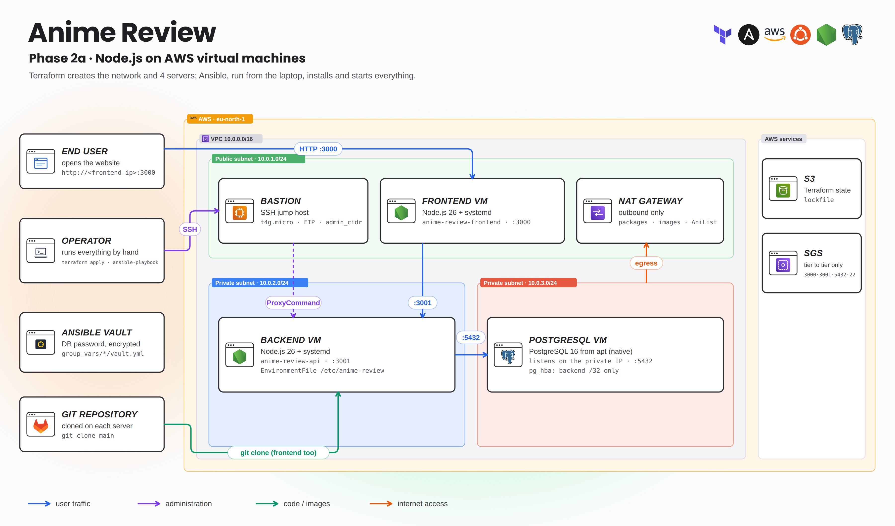
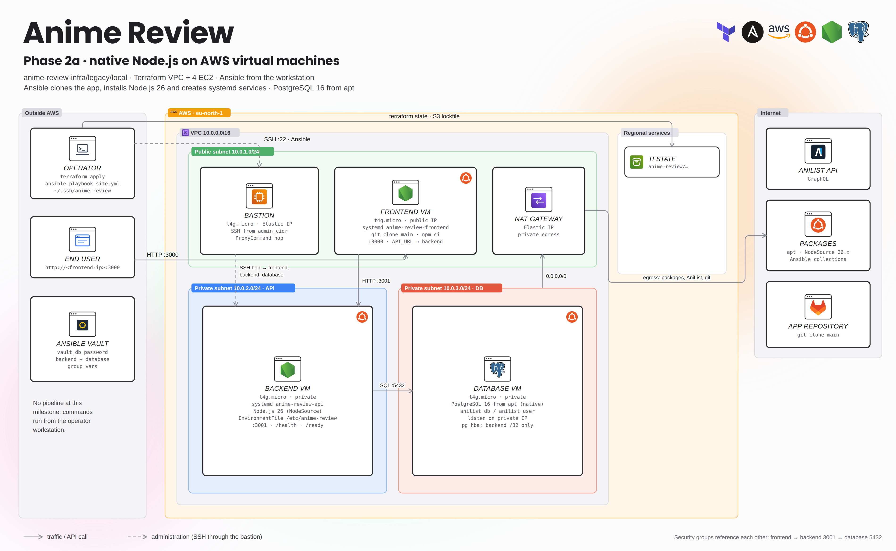
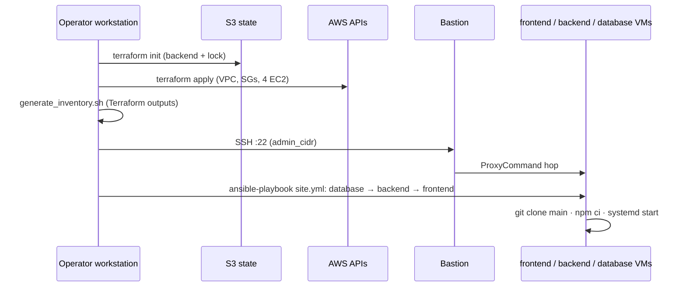

# Phase 2a · Native Node.js on AWS virtual machines

[← Phase 3 (current)](../../README.md) · [Phase 2b · Docker on VMs](../vm/README.md) · [AWS foundations](../../docs/BOOTSTRAP-AWS.md) · [Variables](../../docs/CONFIGURATION.md)

First cloud deployment of Anime Review. Terraform creates a three-tier network and four ARM64 VMs; **Ansible, run from the operator workstation**, installs PostgreSQL, clones the application from Git and runs the frontend and API as **systemd services**. There was no pipeline at this milestone. “local” in the folder name refers to Ansible running locally, not to the machines.



<details>
<summary><b>Detailed view</b> (every component, port and job)</summary>



</details>

## Implemented DevOps features

| Area | What was implemented |
|---|---|
| Network (Terraform) | VPC `10.0.0.0/16`; public subnet `10.0.1.0/24` (bastion, frontend, NAT); private API subnet `10.0.2.0/24`; private DB subnet `10.0.3.0/24`; IGW, NAT Gateway, one route table per tier |
| Compute | 4 × Ubuntu ARM64 `t4g.micro`: bastion (Elastic IP), frontend (public IP), backend, database |
| Security groups | Internet → frontend :3000 · frontend → backend :3001 · backend → database :5432 · admin CIDR → bastion :22 · bastion → every VM :22. Groups reference each other, never `0.0.0.0/0` inbound |
| Remote state | S3 backend, key `anime-review/terraform.tfstate`, lockfile |
| Inventory | `generate_inventory.sh` reads Terraform outputs, uses private IPs and an SSH `ProxyCommand` through the bastion |
| Database (Ansible) | PostgreSQL 16 from apt, `anilist_db` / `anilist_user`, listens on the private IP, `pg_hba.conf` allows only the backend `/32` |
| Application (Ansible) | NodeSource 26.x, dedicated system users, `git clone main`, `npm ci --omit=dev`, `EnvironmentFile` in `/etc/anime-review`, systemd units `anime-review-api` and `anime-review-frontend` |
| Secrets | DB password in **Ansible Vault** (`group_vars/{backend,database}/vault.yml`) |
| Checks | `/health` and `/ready` endpoints, `tests/*.sh` smoke commands |



## Prerequisites

- [AWS foundations](../../docs/BOOTSTRAP-AWS.md) done: state bucket exists, admin AWS profile works.
- Workstation: Terraform ≥ 1.10, AWS CLI v2, Ansible, `jq`, SSH ([WORKSTATION](../../docs/WORKSTATION.md)).
- SSH key `~/.ssh/anime-review` (+ `.pub`). Your public IP for `admin_cidr`.
- A database password of your choice.
- The application repository must be clonable by the VMs (public, or a read-only deploy token: never commit it in the playbook URL).

### Files to prepare

| Example | Copy to | Then |
|---|---|---|
| `docs/examples/vm.terraform.tfvars.example` | `legacy/vm/terraform/terraform.tfvars` | fill `admin_cidr`, `ssh_public_key` |
| `docs/examples/vault-native.yml.example` | `legacy/local/inventory/group_vars/backend/vault.yml` **and** `…/database/vault.yml` | same password in both, then `ansible-vault encrypt` |

The Vault files committed in the repository are encrypted with the original password. Replace them with your own if you do not have it.

## Deploy

All commands run from the **infra repository root**. Terraform lives in `legacy/vm/terraform` and is shared by phases 2a and 2b: they are two ways to deploy the application on the **same four VMs** (never run both at once, they use the same ports).

### 1 · Provision

```bash
cp docs/examples/vm.terraform.tfvars.example legacy/vm/terraform/terraform.tfvars   # edit it
terraform -chdir=legacy/vm/terraform init
terraform -chdir=legacy/vm/terraform plan -out=vm.tfplan
terraform -chdir=legacy/vm/terraform apply vm.tfplan
terraform -chdir=legacy/vm/terraform output
```

### 2 · Inventory

`legacy/local/scripts/generate_inventory.sh` still points to the pre-archive Terraform path. Generate the inventory with the phase 2b script and reuse it:

```bash
chmod 600 ~/.ssh/anime-review
bash legacy/vm/ansible/scripts/generate_inventory.sh
cp legacy/vm/ansible/inventory/inventory.ini legacy/local/inventory/inventory.ini
ansible-inventory -i legacy/local/inventory/inventory.ini --graph
```

### 3 · Secrets

```bash
cp docs/examples/vault-native.yml.example legacy/local/inventory/group_vars/backend/vault.yml
cp docs/examples/vault-native.yml.example legacy/local/inventory/group_vars/database/vault.yml
# put the same password in both files
ansible-vault encrypt legacy/local/inventory/group_vars/backend/vault.yml
ansible-vault encrypt legacy/local/inventory/group_vars/database/vault.yml
```

### 4 · Configure

```bash
ansible-galaxy collection install community.postgresql
ansible private -i legacy/local/inventory/inventory.ini --ask-vault-pass \
  -m wait_for_connection -a 'timeout=300'
# deb822_repository needs python3-debian on the targets
ansible 'backend:frontend' -i legacy/local/inventory/inventory.ini --ask-vault-pass \
  -b -m apt -a 'name=python3-debian state=present update_cache=true'
ansible-playbook -i legacy/local/inventory/inventory.ini --ask-vault-pass \
  legacy/local/playbooks/site.yml
```

Order: `database.yml` → `backend.yml` → `frontend.yml`. Before running, set the Git URL in `backend.yml` / `frontend.yml` to your application repository.

### 5 · Verify

```bash
FRONTEND_IP=$(terraform -chdir=legacy/vm/terraform output -raw frontend_public_ip)
curl --fail "http://$FRONTEND_IP:3000/health"
ansible backend -i legacy/local/inventory/inventory.ini --ask-vault-pass \
  -m uri -a 'url=http://localhost:3001/ready'
```

Then open `http://FRONTEND_IP:3000`, create a reader and a review, reload: the data must persist. Logs: `journalctl -u anime-review-api` / `-u anime-review-frontend`.

To redeploy new code, rerun the playbook and restart the services explicitly (the backend has no restart handler):

```bash
ansible backend -i legacy/local/inventory/inventory.ini --ask-vault-pass -b \
  -m systemd_service -a 'name=anime-review-api state=restarted daemon_reload=true'
```

## Limits of this phase (why phase 2b exists)

- Code is built on every server (`npm ci` on the VM): no immutable artifact, and `git clone main` is not pinned to a commit.
- Node.js 26 on the VMs vs Node.js 24 in the images later: environments drift.
- Everything is manual, from the workstation; SSH host key checking is disabled in the inventory.
- PostgreSQL config paths are fixed to `/etc/postgresql/16/main`.

## Cleanup

Back up the database (`pg_dump` on the DB VM), then `terraform -chdir=legacy/vm/terraform destroy`. Keep the `bootstrap/` foundations for the next phases.
