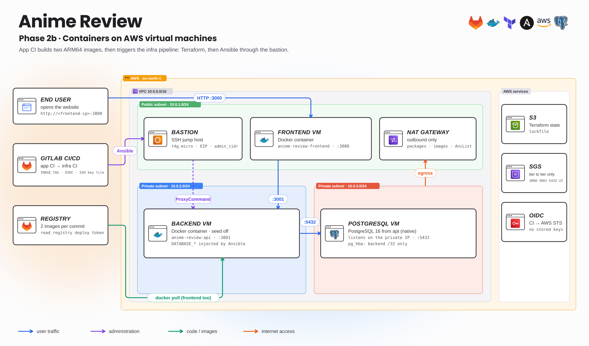
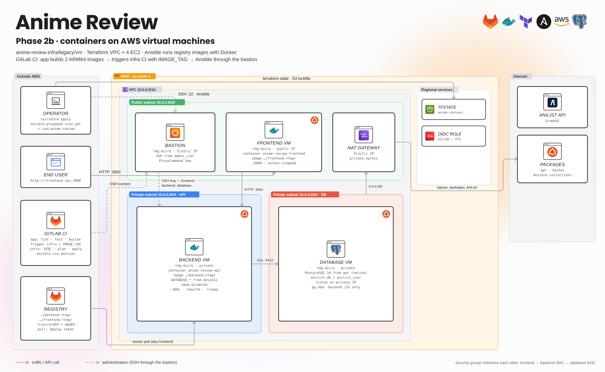
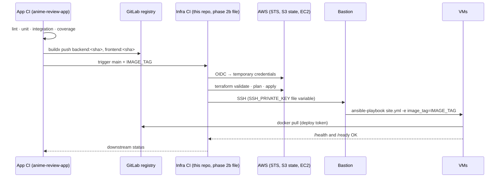

# Phase 2b · Containers on AWS virtual machines

[← Phase 3 (current)](../../README.md) · [Phase 2a · native Node.js](../local/README.md) · [AWS foundations](../../docs/BOOTSTRAP-AWS.md) · [Variables](../../docs/CONFIGURATION.md) · [Recovered pipelines](../../docs/ci-history/README.md)

Same network and VMs as phase 2a, but the frontend and API now run as **Docker containers pulled from the GitLab registry**, and the whole chain is automated: the application pipeline builds two multi-arch images, then **triggers this infrastructure pipeline** with the image tag; Terraform runs through OIDC and Ansible deploys through the bastion. PostgreSQL stays native on its VM.



<details>
<summary><b>Detailed view</b> (every component, port and job)</summary>



</details>

## Implemented DevOps features

| Area | What was implemented |
|---|---|
| Terraform | `legacy/vm/terraform`: VPC, 3 subnets (public / API / DB), IGW, NAT, per-tier route tables and security groups, 4 × `t4g.micro` ARM64, bastion EIP; S3 state `anime-review/terraform.tfstate` |
| Immutable artifacts | Images `…/backend:<sha>` and `…/frontend:<sha>` built once by app CI (`linux/amd64` + `linux/arm64`), never on the servers |
| Ansible roles | `docker.yml` (Docker Engine) → `database.yml` (PostgreSQL 16) → `backend.yml` → `frontend.yml` |
| Containers | `community.docker.docker_container`, `pull: always`, `restart_policy: unless-stopped`, env injected by Ansible (`DATABASE_*`, `API_URL`), seed disabled, `no_log` on secrets |
| Health gates | Ansible waits for `/health` then `/ready` before moving on |
| Registry auth | GitLab **deploy token** (`read_registry`) stored in Ansible Vault |
| CI/CD | multi-project pipeline app → infra, `strategy: depend`, OIDC → STS for Terraform, SSH key and Vault password as GitLab **File** variables |



## Prerequisites

Everything from [phase 2a](../local/README.md#prerequisites), plus:

- Both images published for **arm64** (the VMs are Graviton). See the app repository, [phase 2 guide](https://github.com/Songhai9/anime-review-app/blob/main/legacy/vm/README.md).
- A GitLab **deploy token** with `read_registry` on the application project.
- For CI: runner image `ci-image:1.0` (phase 2 version of `ci/Dockerfile`) in your registry, and a runner whose egress IP is allowed by `admin_cidr` (a shared SaaS runner has changing IPs).

### Files to prepare

| Example | Copy to | Then |
|---|---|---|
| `docs/examples/vm.terraform.tfvars.example` | `legacy/vm/terraform/terraform.tfvars` | fill values |
| `docs/examples/vault-vm.yml.example` | `legacy/vm/ansible/inventory/group_vars/all/vault.yml` | `ansible-vault encrypt` |
| — | `legacy/vm/ansible/inventory/group_vars/all/vars.yml` | set `registry_image_prefix` to your registry path |

Old `backend/vault.yml` and `database/vault.yml` in that inventory must be decryptable with the **same** Vault password, or removed from your copy.

### GitLab variables for the pipeline

| Project | Variable | Type | Value |
|---|---|---|---|
| infra | `AWS_ROLE_ARN` | Variable | `terraform_ci_role_arn` output of `bootstrap/` |
| infra | `TF_VAR_admin_cidr` | Variable | runner/workstation egress `/32` |
| infra | `TF_VAR_ssh_public_key` | Variable | public key contents |
| infra | `SSH_PRIVATE_KEY` | **File** | private key, with trailing newline |
| infra | `ANSIBLE_VAULT_PASSWORD_FILE` | **File** | Vault password |
| app | — | — | `IMAGE_TAG` is computed and forwarded by `trigger_infra` |

Also allow the app project in the infra project's **Job token permissions**.

## Deploy manually

From the infra repository root:

```bash
# 1. Provision (skip if phase 2a already created the VMs)
terraform -chdir=legacy/vm/terraform init
terraform -chdir=legacy/vm/terraform plan -out=vm.tfplan
terraform -chdir=legacy/vm/terraform apply vm.tfplan

# 2. Inventory through the bastion
chmod 600 ~/.ssh/anime-review
bash legacy/vm/ansible/scripts/generate_inventory.sh
ansible-inventory -i legacy/vm/ansible/inventory/inventory.ini --graph

# 3. Secrets
cp docs/examples/vault-vm.yml.example legacy/vm/ansible/inventory/group_vars/all/vault.yml   # edit
ansible-vault encrypt legacy/vm/ansible/inventory/group_vars/all/vault.yml

# 4. Deploy a published tag
ansible-galaxy collection install -r legacy/vm/ansible/requirements.yml
export IMAGE_TAG=<short-sha-published-by-app-ci>
ansible-playbook -i legacy/vm/ansible/inventory/inventory.ini --ask-vault-pass \
  -e "image_tag=$IMAGE_TAG" legacy/vm/ansible/playbooks/site.yml
```

If the VMs previously ran phase 2a, stop and disable `anime-review-api` / `anime-review-frontend` systemd units first so ports 3000/3001 are free. PostgreSQL and its data stay in place.

## Deploy with the pipeline

The phase 2b pipeline is archived at [`legacy/.gitlab-ci.yml`](../.gitlab-ci.yml) (paths already adapted to `legacy/vm/…`). GitLab does not run it while the root `.gitlab-ci.yml` is the Kubernetes pipeline. To reactivate it on a dedicated project or branch, set **Settings → CI/CD → General pipelines → CI/CD configuration file** to `legacy/.gitlab-ci.yml`.

| Job | Stage | Runs when |
|---|---|---|
| `validating_job` | validate | every pipeline on `main` |
| `planning_job` | plan | every pipeline |
| `provisioning_job` | provision | every pipeline (**automatic apply**) |
| `configuring_job` | configure | only when `IMAGE_TAG` is set (i.e. triggered by app CI) |

On the app side, use [`docs/ci-history/phase2-vm.gitlab-ci.yml`](https://github.com/Songhai9/anime-review-app/blob/main/docs/ci-history/phase2-vm.gitlab-ci.yml), which ends with `trigger_infra`.

## Verify

```bash
FRONTEND_IP=$(terraform -chdir=legacy/vm/terraform output -raw frontend_public_ip)
curl --fail "http://$FRONTEND_IP:3000/health"
ansible 'frontend:backend' -i legacy/vm/ansible/inventory/inventory.ini --ask-vault-pass \
  -b -m command -a 'docker ps --format "{{.Names}} {{.Image}} {{.Status}}"'
```

Both containers must show the expected `<sha>` tag. Logs: `docker logs anime-review-api`. Troubleshoot the API → DB path layer by layer: route → security group → listening address → `pg_hba.conf` → credentials. Never open 5432 to the Internet.

## Limits of this phase (why phase 3 exists)

- One instance per tier: no redundancy, no rolling update (a new tag restarts the only container).
- The runner needs SSH access to the bastion; host key checking is disabled.
- Apply is automatic on every `main` pipeline.
- Each VM is configured individually; there is no scheduler, self-healing or service discovery.

## Cleanup

`pg_dump` the database, then `terraform -chdir=legacy/vm/terraform destroy`. The VM and cluster states are separate: this never touches phase 3 resources.
